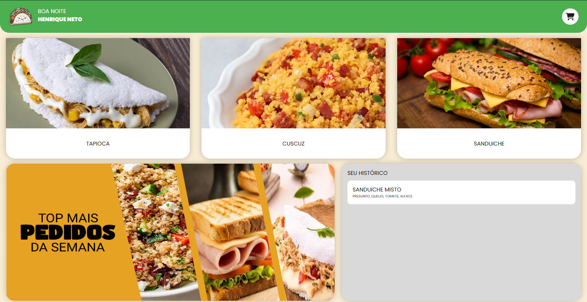
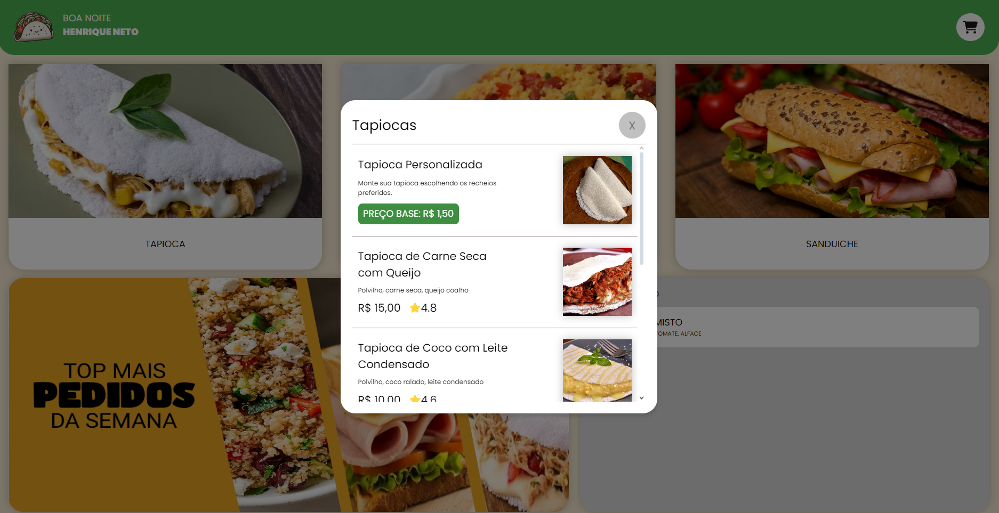
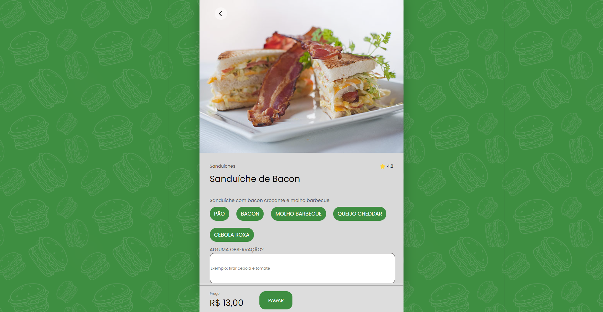

#  Tapiocaria GlauGlau
<div align="center">


</div>

Site de uma tapiocaria / Lanchonete, o design do projeto é inspirado em um totem de autoatendimento, e a versão mobile é inspirado em apps de delivery. Esse projeto é um trabalho da faculdade, na disciplina de Web I.

##  Topicos

- [Descrição do Projeto](#descrição-do-projeto)
- [Screenshots Do Projeto](#screenshots-do-projeto)
- [Tecnologias Utilizadas](#tecnologias-utilizadas)
- [Endpoints da API](#endpoints-da-api)
- [Como Executar o Projeto Localmente](#como-executar-o-projeto-localmente)
- [Como Configurar o Banco De Dados](#como-configurar-o-banco-de-dados)
- [Licença](#licença)
- [Contato](#contato)

##  Descrição do Projeto

Este projeto é **uma aplicação web para uma lanchonete/tapiocaria**, desenvolvida para proporcionar uma experiência intuitiva e prática para os clientes. O site permite que os usuários escolham seus lanches de forma rápida e eficiente, com um fluxo de navegação otimizado tanto para **autoatendimento em totens** (quando integrado ao Electron) quanto para uso em **dispositivos móveis**, onde o design se adapta para parecer um aplicativo de pedidos.

### Funcionalidades principais:

**Tela de entrada:** O usuário escolhe se é um cliente cadastrado ou não.
- Se **cadastrado**, insere o CPF para login e é direcionado à página de vendas.
- Se **não cadastrado**, acessa diretamente a página de vendas sem necessidade de login.

**Página de vendas:** O cliente pode navegar entre três categorias de lanches:
- Tapiocas
- Sanduíches
- Cuscuz

**Seleção de lanches:**

- Ao escolher uma categoria, é exibida uma lista de lanches disponíveis.
- O primeiro item da lista é um lanche personalizável, onde o cliente pode escolher os recheios.

Esse sistema foi projetado para ser facilmente adaptado a um **totem de autoatendimento** utilizando **Electron**, garantindo uma experiência fluida em estabelecimentos físicos. Além disso, quando acessado via **dispositivos móveis**, o layout se transforma para simular um **aplicativo de pedidos**, tornando o uso ainda mais intuitivo.

##  Screenshots Do Projeto
**Screenshots Mobile - (Clique nas imagens para amplia-las)**

<div class="mobile">
  
</div>

**Screenshots Desktop - (Clique nas imagens para amplia-las)**

<div class="desktop">

  
  
  

</div>


##  Tecnologias Utilizadas

- **Frontend**:

  [](https://skillicons.dev)

- **Backend**:
  
  [](https://skillicons.dev)

- **APIs**:
  - Endpoints RESTful para gerenciamento de alimentos, recheios e vendas
    

## </> Endpoints da API

### 1. **Obter dados de todas as linguagens**
**Endpoint:** `/dados`

**Parâmetros de Consulta:**
- `id` ID da linguagem.

**Exemplo de Requisição:**
```http
GET /dados?id=1
```

**Exemplo de Resposta:**
```json
{
    "id": 1,
    "nome": "Python",
    "foto_url": "https://cdn.iconscout.com/icon/free/png-256/free-python-logo-icon-download-in-svg-png-gif-file-formats--technology-social-media-vol-5-pack-logos-icons-3030224.png?f=webp",
    "tipo": "back",
    "dica1": "x = [i**2 for i in range(5)]",
    "dica2": "def soma(a, b): return a + b",
    "dica3": "for i in range(5): print(i)",
    "dica4": "print(\"Hello, World!\")",
    "dica5": "# código em Python"
}
```

### 2. **Obter Avatares (foto de perfil) dos jogadores**
**Endpoint:** `/avatars`

**Parâmetros de Consulta:**
- `id` ID do avatar.

**Exemplo de Requisição:**
```http
  http://localhost:3000/avatars?id=1
```

**Exemplo de Resposta:**
```json
[
  {
    "id": 1,
    "image_url": "https://api.dicebear.com/9.x/adventurer/svg?seed=Jessica&hair=long22&hairColor=592454"
  }
]
```

### 3. **Obter Ranking de Jogadores**
**Endpoint:** `/ranking`

**Exemplo de Requisição:**
```http
  http://localhost:3000/ranking
```

**Exemplo de Resposta:**
```json
{
  "message": "Ranking obtido com sucesso!",
  "data": [
    {
      "id": 2,
      "nick": "Glauedson",
      "cor": "#e4f312",
      "avatar": "https://api.dicebear.com/9.x/adventurer/svg?seed=Eliza&earrings[]&earringsProbability=100&glassesProbability=100&hair=short08&hairColor=6a4e35&mouth=variant02&skinColor=f2d3b1",
      "pontos": 14000,
      "modo_jogo": "Pelo Codigo"
    }
  ]
}
```

## </> Estrutura do Banco de Dados

### Tabelas

#### 1. **Tabela `linguagens`**
Armazena as linguagens e algumas informações adicionais pro front.

```sql
CREATE TABLE linguagens (
    id SERIAL PRIMARY KEY, 
    nome VARCHAR(50) NOT NULL,
    foto_url TEXT NOT NULL, 
    tipo VARCHAR(20) NOT NULL,
    dica1 TEXT NOT NULL,
    dica2 TEXT NOT NULL,
    dica3 TEXT NOT NULL,
    dica4 TEXT NOT NULL,
    dica5 TEXT NOT NULL
);
```

**Colunas:**
- `id`: Identificador único.
- `nome`: Nome da linguagem (ex.: C#, Java, Python).
- `foto_url`: URL da logo da linguagem.
- `tipo`: Tipo da linguagem ( ex.: Back, Front, Bd).
- `dica`: de 1 a 4 são as linhas de codigo de dicas pro jogador.
- `dica5`: Linha final que aparece quando o jogador erra todas as tenativas.

#### 2. **Tabela `imagens`**
Armazena os links das imagens de avatares pro jogador escolher, as imagens foram pegas no site da API [DiceBear](https://www.dicebear.com/why-dicebear/).

```sql
CREATE TABLE images (
    id SERIAL PRIMARY KEY, 
    image_url TEXT NOT NULL
);
```

**Colunas:**
- `id`: Identificador único do Avatar.
- `image_url`: URL do Avatar.

#### 3. **Tabela `ranking`**
Registra os dados e a pontuação de cada jogador.

```sql
CREATE TABLE ranking (
    id SERIAL PRIMARY KEY,
    nick VARCHAR(100) NOT NULL,
    cor VARCHAR(7) NOT NULL,
    avatar TEXT NOT NULL,
    pontos INT NOT NULL DEFAULT 0,
    modo_jogo VARCHAR(50) NOT NULL
);
```

**Colunas:**
- `id`: Identificador único para cada registro.
- `nick`: Nome do jogador.
- `cor`: Cor escolhida (no formato hexadecimal, como #FFFFFF).
- `avatar`: URL do avatar.
- `pontos`: Pontos acumulados pelo jogador.
- `modo_jogo`: Modo de jogo (ex: Pelo codigo, Pela Logo).

## </> Como Executar o Projeto Localmente

1. Clone este repositório:
   ```bash
   git clone https://github.com/Glauedson/WhatIsTheLanguage.git
   ```
2. Navegue até o diretório do projeto:
   ```bash
   cd WhatIsTheLanguage
   ```
3. Configure o backend:
   - Certifique-se de que o PostgreSQL está instalado e configurado.
   - Atualize os dados para acessar seu banco de dados na pasta `src/back-end` no arquivo `server.js`.
   - Execute o backend usando o comando no terminal do VsCode:
     ```bash
     node src/back-end/server.js
     ```
4. Inicie o frontend abrindo o arquivo `index.html` em um navegador.

## </> Como Configurar o Banco De Dados

Como configurar o banco de dados PostgreSQL e executar os scripts `create.sql` e `insert.sql` para iniciar corretamente o jogo.

### 1. Instalar o PostgreSQL

Se ainda não possui o PostgreSQL instalado, siga os passos abaixo:

1. Baixe o instalador do PostgreSQL no site oficial: 

    ```http
    https://www.postgresql.org/download/
    ```

2. Durante a instalação, defina uma senha para o usuário postgres.

3. Certifique-se de instalar o **pgAdmin** para gerenciar o banco de forma visual (opcional).

### 2. Criando o Banco de Dados

Após instalar o PostgreSQL, siga os passos para criar o banco de dados:

**Usando o pgAdmin:**

1. Abra o **pgAdmin**.

2. Conecte-se ao servidor PostgreSQL.

3. Clique com o botão direito em **Databases** e selecione **Create > Database**.

4. No campo **Database name**, insira `witl` e clique em **Save**.

**Usando o terminal (psql):**

1. Abra o terminal e execute:

    ```ps
    psql -U postgres
    ``` 
2. Digite a senha do usuário `postgres`.

3. Crie o banco de dados com:
    ```sql
    CREATE DATABASE witl;
    ```

### 3. Executando os Scripts SQL

Agora, vamos criar as tabelas e inserir os dados iniciais.

**Usando o pgAdmin:**

1. No **pgAdmin**, expanda **Databases > witl > Schemas > public**.

2. Clique em **Query Tool**.

3. Copie e cole o conteúdo do arquivo `create.sql` e execute.

4. Faça o mesmo para `insert.sql`.

**Usando o terminal (psql):**

1. No terminal, conecte-se ao banco de dados:
    ```ps
    psql -U postgres -d witl_db
    ```
2. Execute os arquivos SQL:
    ```bash
    \i /caminho/para/create.sql
    \i /caminho/para/insert.sql
    ```

### 4. Verificando os Dados

Após rodar os scripts, você pode conferir se os dados foram inseridos corretamente.

No **pgAdmin** ou no **terminal**, execute:

```sql
SELECT * FROM ranking;
```

Isso deve exibir os jogadores e suas pontuações.

## 📄 Licença

Este projeto não possui uma licença definida. Sinta-se livre para utilizar e modificar o código conforme necessário.

## 📩 Contato

Para dúvidas ou sugestões, entre em contato:

- **Nome**: Glauedson Carlos Rodrigues
- **Email**: (gluedson18s@gmail.com)
