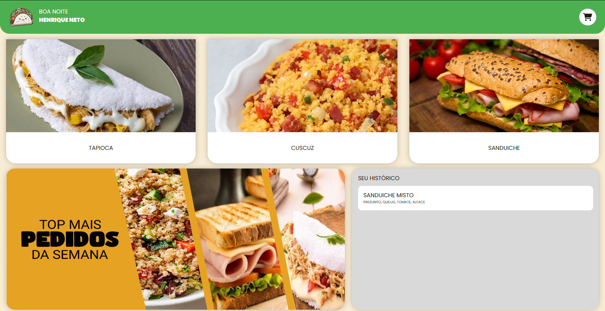
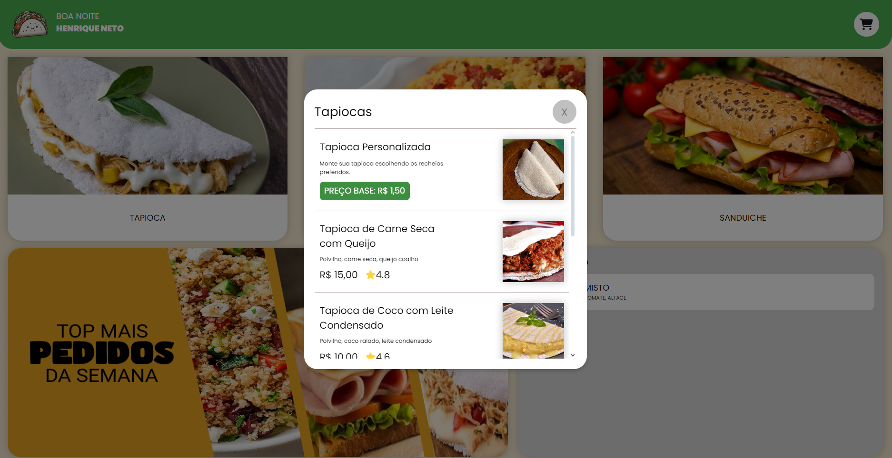
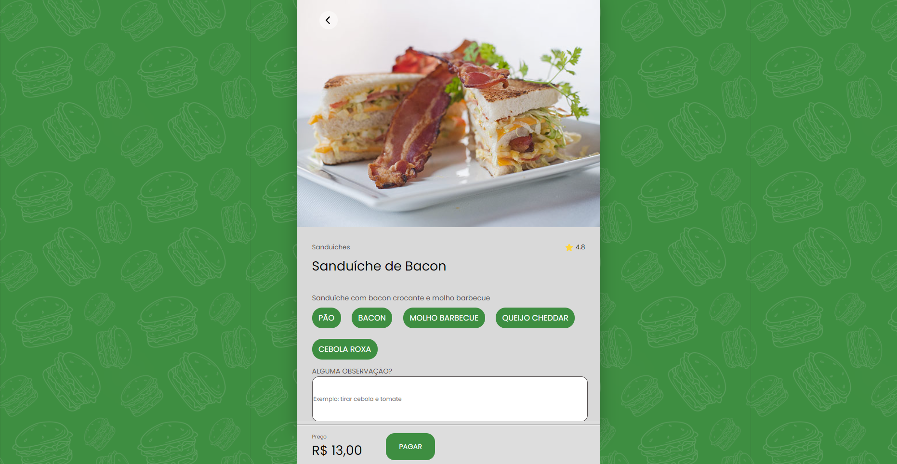

# TAPIOCARIA 

Este é o repositório do site da **Tapiocaria Online**, um projeto que foi idealizado na faculdade, na cadeira de WEB I.

## Tecnologias Utilizadas
- **Frontend**: HTML, CSS, JavaScript
- **Backend**: Kotlin
- **Frameworks**: SpringBoot
- **Banco de Dados**: Postgre

## Como Rodar o Projeto Localmente

**Clone este repositório**:
   ```bash
   git clone https://github.com/Glauedson/Tapiocaria.git
   ````

**Instale o banco de dados**


# fotos do projeto




